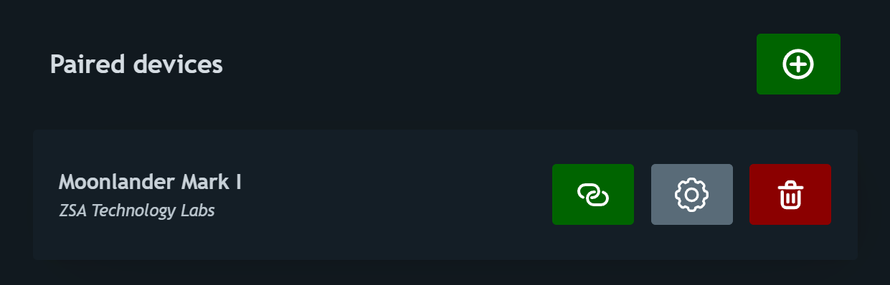
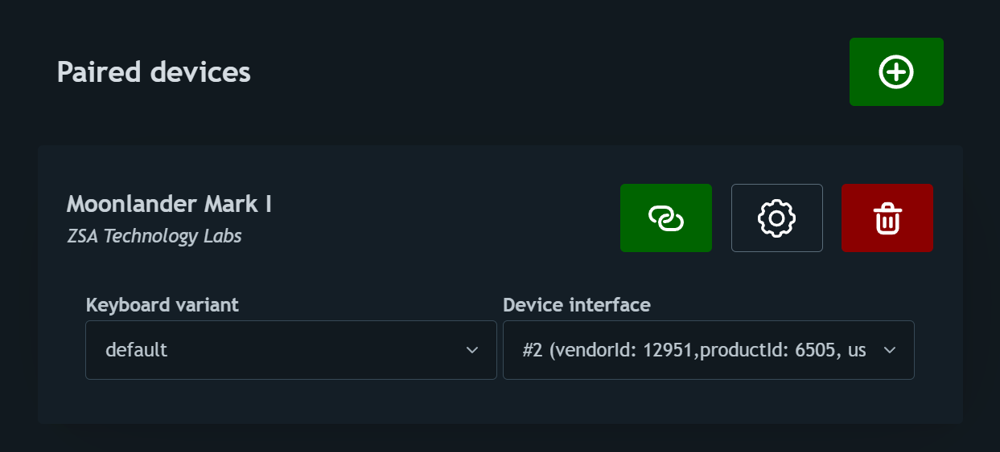
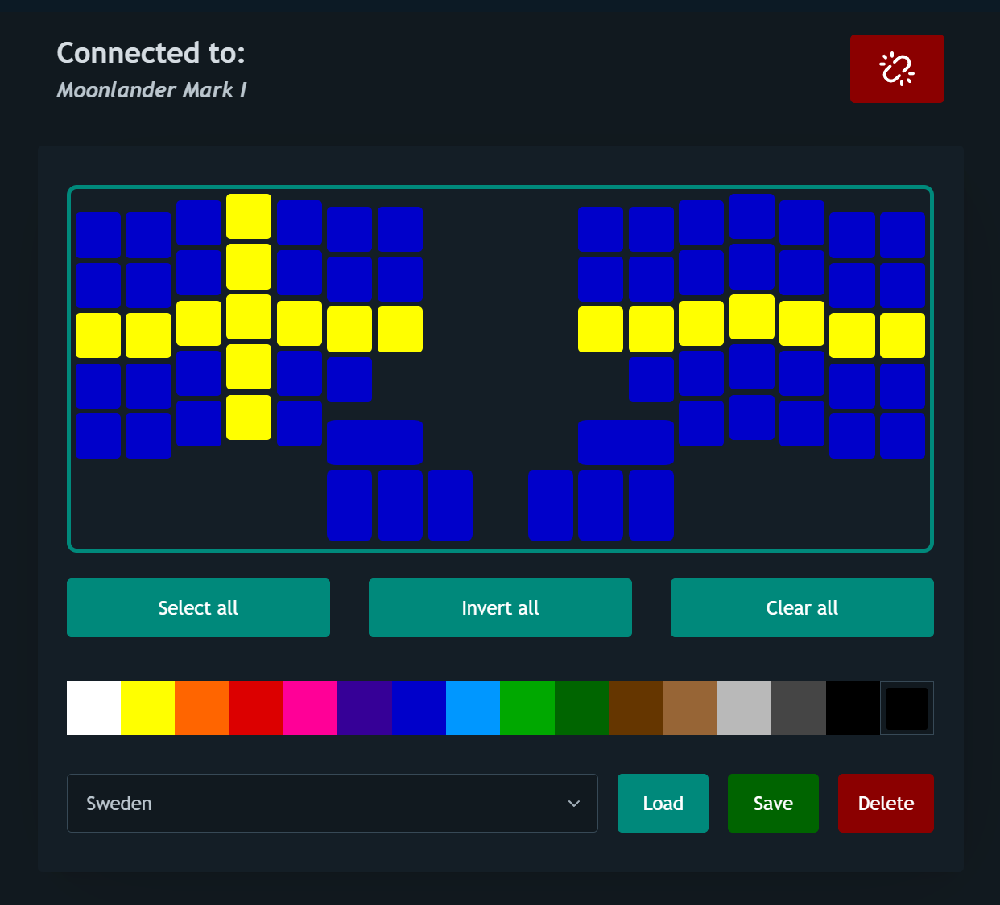

QMK RGB live configurator
=========================

Hey there! 👋

This is a small application that allows you to control the RGB matrix of your QMK-enabled keyboard on-the-fly directly in your browser. You don't need to install anything on your PC other than a browser that supports WebHID like Chrome or Edge. Your keyboard firmware needs a bit of extra code, though.

Disclaimer
----------

This project exists solely because I wanted to learn how to use some technologies like VueJS and WebHID, and this seemed like a fun little project to apply them together, so don't expect much out of it. In principle, I only cared to make it work with my Moonlander Mark I keyboard. However, since the QMK firmware repository already defines the keyboard matrix (that is, the physical layout of each key) for most of its supported keyboards, it should be easy to use this software with any other QMK-enabled keyboard that supports RGB matrix and that includes the HID message handler that responds to the HID messages generated by the browser --- see details about this below.

Screenshots
-----------

Listing paired devices:

Keyboard configuration:

Keyboard RGB controller:

Supported keyboards
-------------------

I am only adding support for a few hand-picked keyboards that I can test myself in this initial version:

*   ZSA Moonlander Mark I
*   ZSA Planck (ortho\_4x12, 1x2uC, 1x2uL and 1x2uR variants)

If yours is not one of them, please open an issue in GitHub and I will add it!

Keyboard variants and interfaces
--------------------------------

**Keyboard variants:** Some keyboard models have more than one variant. For instance, by having larger keys for the space bar and such. If there's more than one variant for your keyboard, you will need to select it manually.

**HID interfaces:** When enabling RAW HID in your QMK keyboard, some of you might notice that some keyboards expose more than one HID interface. In some cases, we can tell which one to use and select that by default. In other cases you might need to select it manually, which involves a bit of trial and error.

After you selected both your keyboard variant and HID interface and pressed the "connect" button, the tool automatically saves this to local storage, so you only need to worry about this once.

Communication protocol
----------------------

For now, the tool implements a very simple communication protocol:

1.  When connecting to the keyboard, we send the REMOTE\_RGB\_START message to tell the keyboard to enter the REMOTE\_RGB mode.
2.  When clicking on a color (either from the palette or from the color picker), we send the REMOTE\_RGB\_SET\_COLOR message to tell the keyboard to change the color of the keys currently selected in the tool's interface to the color we just picked.
    NOTE: since the HID message size supported by QMK is (as far as I know) 32 bytes, we first need to split the selected keys into as many messages as needed to tell the keyboard to repaint all the selected keys. Each individual message communicates up to 12 keys to be repainted at a time. You don't need to care about this, though, it all happens under the hood.
3.  When disconnecting the keyboard, we send the REMOTE\_RGB\_STOP message to tell the keyboard to leave the REMOTE\_RGB mode.

In case you're interested, here is the shape of each kind of message:

**REMOTE\_RGB\_START**

| Byte | Description                       |
|------|-----------------------------------|
| 0    | Message kind (REMOTE\_RGB\_START) |
| 1-31 | Unused                            |

**REMOTE\_RGB\_STOP**

| Byte | Description                      |
|------|----------------------------------|
| 0    | Message kind (REMOTE\_RGB\_STOP) |
| 1-31 | Unused                           |

**REMOTE\_RGB\_SET\_COLOR**

| Byte  | Description                            |
|-------|----------------------------------------|
| 0     | Message kind (REMOTE\_RGB\_SET\_COLOR) |
| 1     | R value                                |
| 2     | G value                                |
| 3     | B value                                |
| 4     | LED update count (1 to 12)             |
| 5-7   | Unused for now                         |
| 8-9   | LED 1 row/column index                 |
| 10-11 | LED 2 row/column index                 |
| ...   | ...                                    |
| 30-31 | LED 12 row/column index                |

Just show me the keyboard code already
--------------------------------------

Sure, here you go:

**In _rules.mk_, add:**

`RAW_ENABLE = yes`

**In _keymap.c_, add:**

[This snippet](/src/assets/src/remote_rgb.txt)

Attribution
-----------

[Keyboard icons created by Bamicon - Flaticon](https://www.flaticon.com/free-icons/keyboard "keyboard icons")